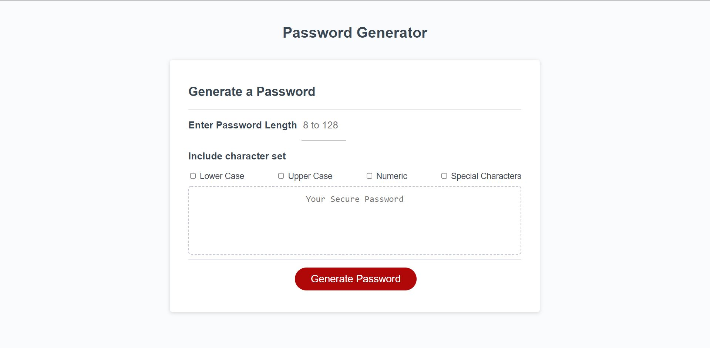
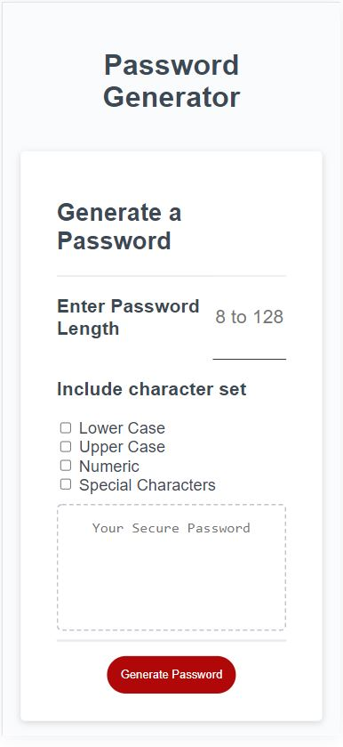
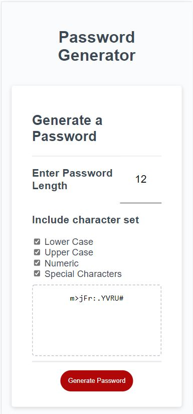

# passgen
## Extra credit for Password Generator

In the real world, I'm not a huge fan of alert prompts to accept user input. This example requires a few minor changes to the source files. I added an input box instead of using alert prompts for the password length.  

Checkboxes determine which character sets to use for password creation.  

CSS changes were added to keep the look consistent with the existing site.  

Alert boxes are still used for input validation errors such as password length violations and not selecting at least one character set.

## Screenshots

Desktop main screen  

Desktop example with generated password  

Mobile main screen  

Mobile example with generated password  

## Live Site
[Password Generator Live Site](https://joebarbone.github.io/passgen/)